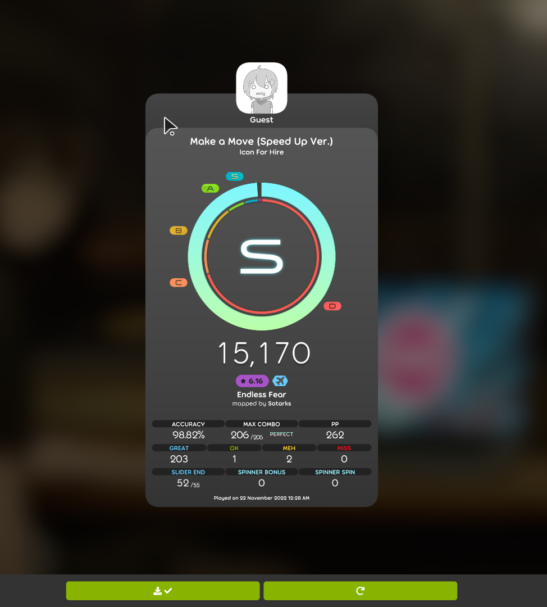
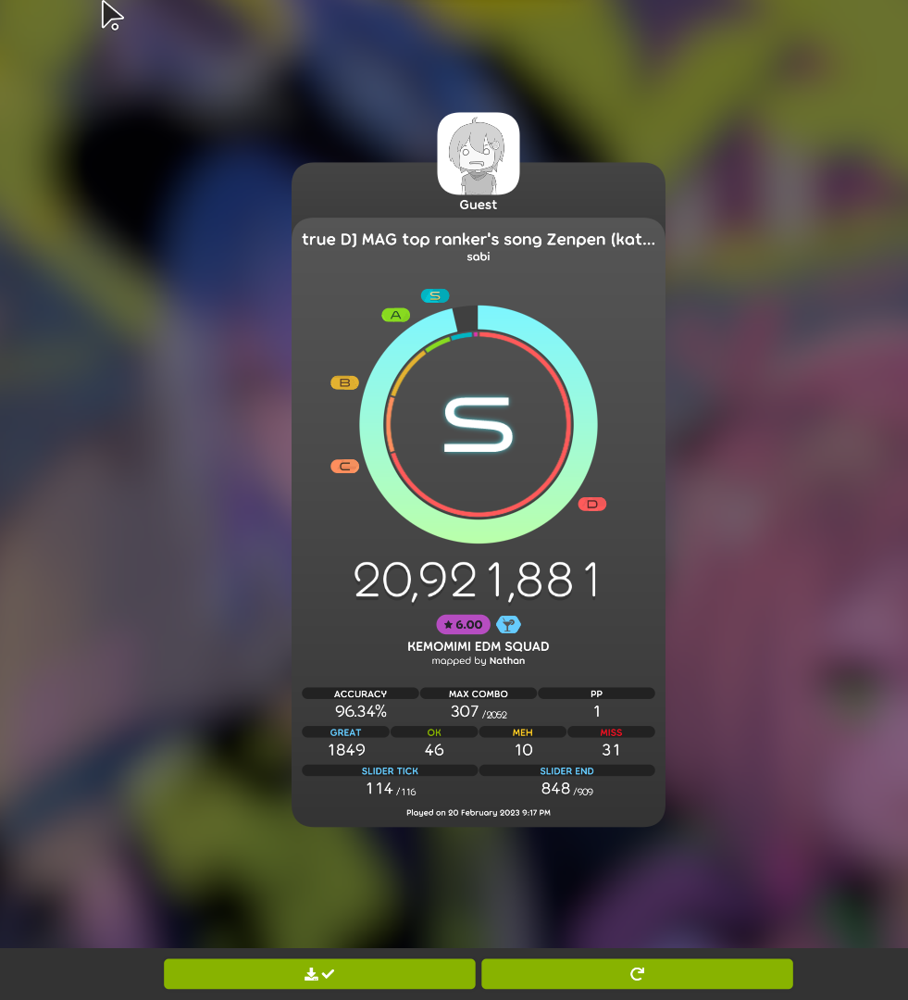

# Osu Neural Network Created Using Pytorch  
- DISCLAIMER : I am not responsible for any consequences that stem from the illicit use of the contents of this repository.  
## Info
- Original skin by [okami187](https://osu.ppy.sh/users/15566410).
  
- screenshots are collected from "Autoplay" and required info is extracted during dataset creation.

- The model is currently only capable of clicking.

- The skin the model currently uses is [here](/Oka_Custom.osk).

- Showcase video [here](https://www.youtube.com/watch?v=ZgHyN98iR1M&t=5s).

## Example Autopilot play below on [this map](https://osu.ppy.sh/beatmapsets/765778#osu/1627148).  The model was trained using [this map](https://osu.ppy.sh/beatmapsets/1721048#osu/3560542).

## Example Relax play below on [this map](https://osu.ppy.sh/beatmapsets/1357624#osu/2809623).  The model was trained using [this map](https://osu.ppy.sh/beatmapsets/1511778#osu/3287118).

